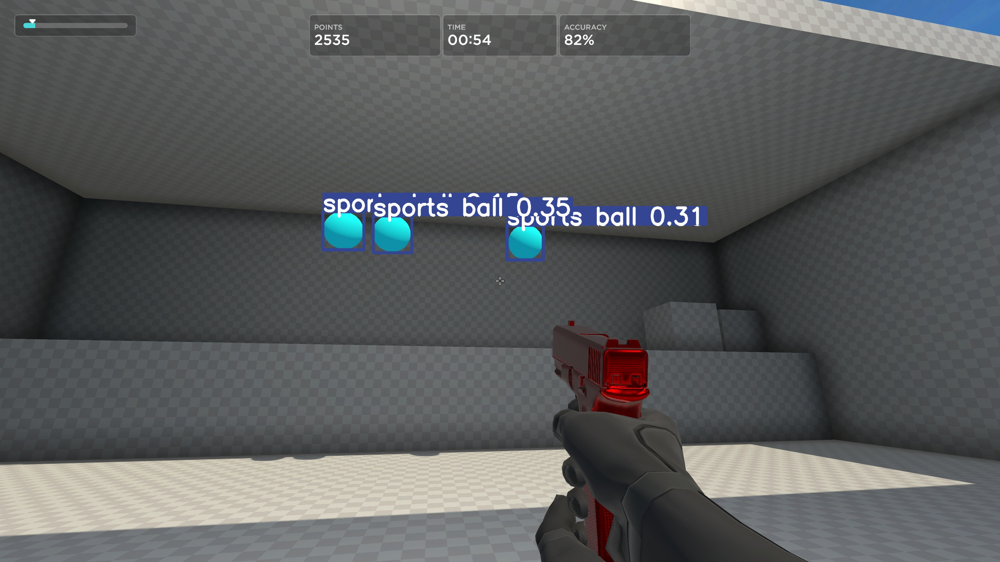
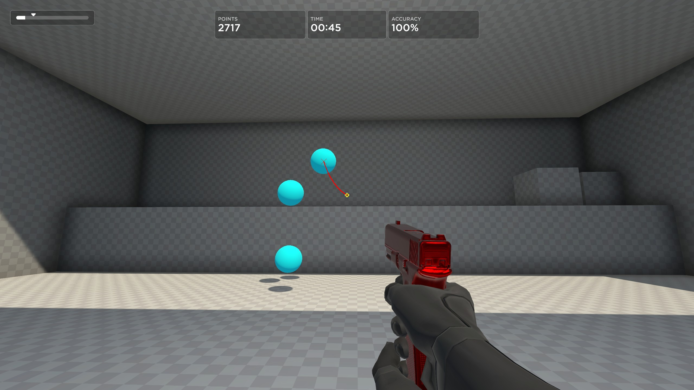

# 🔭 Visée Optronique (Autonomous Optronic Sighting)


**Visée Optronique** est un système expérimental de vision par ordinateur temps réel conçu pour l'acquisition et le suivi de cibles dans des environnements de simulation rapide (ex: Aim Lab).

Développé nativement pour l'architecture **Linux (X11)**, ce projet explore les limites de la latence dans la boucle de détection-action en couplant l'inférence neuronale (YOLO) avec l'injection d'entrées au niveau du noyau (uinput).

---

## ⚡ Caractéristiques Techniques

* **Moteur de Vision Neurale** : Utilisation de **YOLOv10** optimisé pour l'inférence GPU.
* **Pipeline de Capture** : Capture d'écran haute fréquence via **X11/Xlib** sur une *Region of Interest* (ROI) calibrée.
* **Contrôle Moteur Humanoïde** :
  * Lissage adaptatif en fonction de la distance.
  * Trajectoires de Bézier non-linéaires.
  * Micro-stepping pour une fluidité accrue.
* **Intégration Système** : Injection d'événements souris via le module noyau `uinput` pour une émulation matérielle indétectable logiciellement.

## 🛠️ Architecture

Le système fonctionne en boucle fermée selon le schéma suivant :

1.  **Acquisition** : Capture brute du framebuffer (Xorg/X11).
2.  **Inférence** : Détection des cibles via Réseau de Neurones Convolutifs (CNN).
3.  **Décision** : Calcul vectoriel de la cible prioritaire (plus proche voisin).
4.  **Action** : Calcul du delta de mouvement et génération de micro-mouvements (Bézier).

## 📋 Prérequis

* **OS** : Linux (Testé sur Pop!_OS 22.04 LTS).
* **Serveur d'affichage** : **X11 / Xorg** (Wayland n'est pas supporté pour la capture haute performance).
* **GPU** : NVIDIA recommandé (CUDA supporté).
* **Dépendances** : Python 3.10+, `python-xlib`, `uinput`, `ultralytics`, `opencv-python`, `numpy`.

## 📸 Aperçu Technique

| Détection Multi-Cibles | Calcul de Trajectoire (Vecteur) |
|:---:|:---:|
|  |  |
*Démonstration de la segmentation en temps réel et du calcul de compensation.*

## 📺 Démonstration
<div align="center">
  <h2>📺 Démonstration en Jeu</h2>
  <p>Visualisation du Debug Mode avec trajectoire Bézier et Head Offset</p>
  
</div>

## 🚀 Installation

1. **Cloner le dépôt**
  ```bash
  git clone https://github.com/ton-pseudo/visee-optronique.git
  cd visee-optronique
  ```

2. **Créer un environnement et installer les dépendances**
  ```bash
  python -m venv .venv
  source .venv/bin/activate
  pip install -r requirements.txt
  ```

3. **Poids YOLO (obligatoire)**
  - Le modèle est chargé par défaut depuis `yolov10n.pt` à la racine du projet.
  - Placez le fichier **yolov10n.pt** dans le dossier du projet (même niveau que `aimbot.py`).
  - Si vous souhaitez un autre chemin/nom, modifiez l'argument `model_path` dans `VisionSystem` (ou ajustez l'instanciation dans `aimbot.py`).

4. **Exécution**
  - Lancement en mode interactif (nécessite `sudo` si `uinput` n'est pas accessible) :
    ```bash
    sudo .venv/bin/python aimbot.py
    ```

## 🎛️ Commandes Runtime & Calibration

- **HOME** : activer / désactiver le tracking
- **PAGE DOWN** : activer / désactiver le mode debug (affiche la fenêtre OpenCV)
- **F9** : entrer/sortir du mode offset (ajuster l'offset visuel du viseur)
- **F10** : sauvegarder les offsets dans `config_hardware.py`
- **END** : quitter le programme

Calibration et Debug :
- Utilisez `calibrate_roi.py` pour positionner précisément la zone ROI du jeu et sauvegarder `GAME_WINDOW_X` / `GAME_WINDOW_Y`.
- Pour tester la capture, exécutez `test_capture.py` qui écrira `capture_test.jpg`.
- Pour tester l'inférence YOLO sur une image capturée, utilisez `test_yolo_direct2.py`.

## ⚙️ Fichier de configuration
- Les paramètres matériels et de tuning sont dans `config_hardware.py` (sensibilité, BEZIER_STEPS, offsets sauvegardés, YOLO_CONFIDENCE...).
- Offsets persistants : `AIM_OFFSET_X` et `AIM_OFFSET_Y` sont lus au démarrage et peuvent être modifiés via F9 / F10.

## 🧪 Tests
- Les tests unitaires sont dans le dossier `test_unitaire/`. Lancez-les avec `pytest` ou via `python -m unittest discover test_unitaire`.

## Notes techniques rapides
- `VisionSystem.py` fonctionne en mode synchrone (capture + inférence) pour assurer que chaque frame est bien traitée par YOLO en runtime.
- Si vous rencontrez une erreur d'unpickling sur le chargement du modèle, le loader force `weights_only=False` pour garantir la compatibilité avec certaines versions de PyTorch/Ultralytics.


